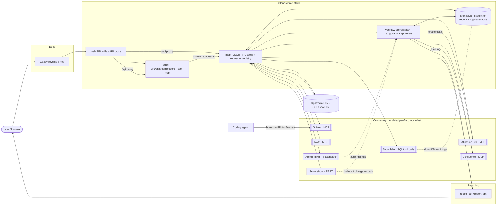

# sglandsimple

A small docker-compose stack that puts an OpenAI-compatible **agent endpoint** in front of an existing SGLang/vLLM server, and exposes the same tools over an **MCP server**.

```
client ──► agent (/v1/chat/completions)  ──►  upstream LLM (your SGLang/vLLM)
                │
                └──► mcp (tools/list, tools/call)
                          ├── summarize_text
                          ├── chat
                          ├── echo
                          └── web_research  ──► SearXNG  +  SGLang workflow
```

The agent fetches tools from the MCP server, advertises them on every chat completion, and auto-executes any tool calls the model emits against MCP — so a plain OpenAI client gets tool use "for free."

## Quick start

```bash
cp .env.example .env.local  # then edit UPSTREAM_BASE_URL / UPSTREAM_MODEL / SEARXNG_URL
docker compose up --build -d
```

`.env.local` is gitignored. The required vars (`UPSTREAM_BASE_URL`, `UPSTREAM_MODEL`, `SEARXNG_URL`) have no defaults — compose will refuse to start if they're unset.

### Data persistence & reseeding

MongoDB data lives on a **host bind mount at `./perm/db`** (gitignored), so it survives `docker compose down` and `--build` — a bind mount is never removed by `down -v` or `volume prune`. The `mongo-seed/*.js` scripts only run on **first init** (empty data dir); after that, refresh or re-apply seed data with:

```bash
scripts/reseed.sh          # re-apply every mongo-seed/*.js
scripts/reseed.sh --wipe   # drop the enterprise DB first, then reseed
```

Services:

- **Agent (OpenAI-compatible)** — public via Caddy at `https://${PUBLIC_HOSTNAME}/v1`, internal host bind on `:${AGENT_PORT}` (default `5450`).
- **MCP server (JSON-RPC over HTTP)** — LAN-only on `:${MCP_PORT}` (default `5451`). Not exposed publicly until Stage 3 hardening.

### Putting Caddy in front

Two ways, pick whichever your Caddy uses:

1. **caddy-docker-proxy**: the `agent` service already carries `caddy` labels that publish `${PUBLIC_HOSTNAME}` → `agent:8000`. No further action.
2. **Static Caddyfile**: copy `caddy/Caddyfile.snippet.example` to `caddy/Caddyfile.snippet.local`, replace the placeholder hostname, then paste/`import` it into your Caddyfile. The `.local` copy is gitignored. Your Caddy container must be on the external `proxy` network so it can resolve `sglandsimple-agent` by name.

## Using the agent

```bash
curl https://${PUBLIC_HOSTNAME}/v1/chat/completions \
  -H "Authorization: Bearer dummy" \
  -H "Content-Type: application/json" \
  -d '{
    "model": "your-model-id",
    "messages": [
      {"role": "user", "content": "Please summarize: the quick brown fox jumps over the lazy dog, repeatedly, for many years."}
    ]
  }'
```

Or against the host directly (bypassing Caddy): `http://<host>:${AGENT_PORT}/v1/...`.

The model will see `summarize_text`, `chat`, and `echo` as available tools and call them as appropriate; the agent dispatches each call to the MCP server and feeds results back until the model returns a final answer.

Drop-in client config:

```json
{
  "baseUrl": "https://<your PUBLIC_HOSTNAME>/v1",
  "api": "openai-completions",
  "apiKey": "dummy",
  "models": [{ "id": "<your UPSTREAM_MODEL>", "name": "<your UPSTREAM_MODEL>" }]
}
```

> Streaming (`stream: true`) is intentionally not implemented — keep it simple. Send `stream: false`.

## web_research workflow (SGLang)

`mcp/web_research.py` is a deliberately small SGLang program meant as a learning artifact:

1. **Search** — `searxng_search` hits the existing SearXNG instance at `SEARXNG_URL` and collects ≥5 deduplicated results (title, url, snippet).
2. **Annotate (parallel fork)** — an `@sgl.function` opens N child states with `s.fork(len(hits))` and runs a one-sentence relevance prompt per result concurrently. Against SGLang's native runtime this leverages shared-prefix RadixAttention; against a remote OpenAI endpoint it degrades to N concurrent HTTP calls — same DSL, different speedup.
3. **Synthesize (constrained JSON)** — a final call uses `response_format={"type": "json_schema", "json_schema": {...}}` to force the model to emit an object with `topic`, `summary` (with `[n]`-style citation markers), `best_result` (index, url, **verbatim quote**, why), and `citations[]`. This is the real win you get from SGLang/vLLM whether or not you use the Python DSL.
4. **Render** — the MCP tool returns two content blocks: a Markdown rendering and the raw JSON.

Call it:

```bash
curl -s localhost:8080/mcp \
  -H 'Content-Type: application/json' \
  -d '{
    "jsonrpc":"2.0","id":9,"method":"tools/call",
    "params":{"name":"web_research","arguments":{"topic":"recent advances in RadixAttention","k":6}}
  }' | jq -r '.result.content[0].text'   # markdown
```

Switch `.content[0]` to `.content[1]` for the JSON payload. The tool is also auto-exposed through the agent, so an OpenAI client can simply ask the model to "research X" and the agent will dispatch it.

## Using the MCP server directly

List tools:

```bash
curl -s http://localhost:8080/mcp \
  -H "Content-Type: application/json" \
  -d '{"jsonrpc":"2.0","id":1,"method":"tools/list"}' | jq
```

Call a tool:

```bash
curl -s http://localhost:8080/mcp \
  -H "Content-Type: application/json" \
  -d '{
    "jsonrpc":"2.0","id":2,"method":"tools/call",
    "params":{"name":"summarize_text","arguments":{"text":"long input here..."}}
  }' | jq
```

## Configuration

All knobs are env vars (see `.env.example`); set them in `.env.local`:

| Var | Required? | Purpose |
| --- | --- | --- |
| `UPSTREAM_BASE_URL` | yes | OpenAI-compatible upstream |
| `UPSTREAM_API_KEY` | no (default `dummy`) | Bearer token for upstream |
| `UPSTREAM_MODEL` | yes | Model id to send upstream |
| `SEARXNG_URL` | yes | SearXNG used by `web_research` |
| `AGENT_PORT` | no (default `8000`) | Host port for agent |
| `MCP_PORT` | no (default `8080`) | Host port for MCP server |
| `OVERVIEW_DUE_SOON_DAYS` | no (default `14`) | Days window for the "due soon" attention rule |
| `OVERVIEW_STALE_DAYS` | no (default `7`) | No-update window (days) for the "stalled" attention rule |
| `OVERVIEW_ATTENTION_LIMIT` | no (default `10`) | Max rows in the attention panel |
| `OVERVIEW_TABLE_ROWS` | no (default `5`) | Rows per mini-table in the Overview multi-table region |
| `OVERVIEW_POLL_MS` | no (default `30000`) | Front-end poll cadence (ms) for `/api/overview` |

Both services attach to the external Docker network `proxy` so they can reach the upstream LLM and SearXNG hosts on the LAN; create it once with `docker network create proxy` if it doesn't already exist.

## Layout

```
agent/   FastAPI service — /v1/chat/completions, MCP-aware tool loop
mcp/     FastAPI MCP server — JSON-RPC at /mcp, tools backed by the upstream LLM
web/     React + shadcn/ui SPA (admin dashboard) served by FastAPI
```

## Compliance workflow hub (Stage 9)

The dashboard's purpose is to let a person open one screen and **relate every
piece of a database-audit-logging compliance workflow** — the originating audit
finding, the Jira epic/stories, the coding work and PR, the Confluence docs, and
the real DB audit logs that prove the control — across many connected systems,
and export it all as a layman-friendly PDF/PPT artifact.

> Full spec, data model, and task breakdown live in `IMPLEMENT.md` (Stage 9).
> The diagrams below are the target design.

**Compliance command center (Stage 11).** The Overview (`/`) page is the
compliance command center: a single polled surface backed by `GET /api/overview`
→ the `overview_summary` MCP tool. It rolls up all Stage-9 compliance collections
in one round-trip and renders four regions: a **KPI row** (open findings, active
epics, in-flight work items, open PRs, connector health, needs-attention count); a
full-width **attention panel** of ranked "points of concern" (overdue → due-soon →
prioritized → high-severity → blocked PR → stalled), each row with a reason chip
and days-to-due badge; a **connector-health strip** (status dots, click → Hub
bubble); and a **multi-table region** (findings / epics / work items / PRs, 5 rows
each, "View all in Hub" links). The activity trend is retained below. The page
never blanks on refetch (stale-while-revalidate). Five tunables control the
attention rules and poll cadence: `OVERVIEW_DUE_SOON_DAYS` (default 14),
`OVERVIEW_STALE_DAYS` (7), `OVERVIEW_ATTENTION_LIMIT` (10), `OVERVIEW_TABLE_ROWS`
(5), `OVERVIEW_POLL_MS` (30000).

**Connector data & Architecture view (Stage 12).** Each connector's Hub pane now
renders domain-shaped mock data keyed by a `schema` hint (AWS multi-service
inventory, Jira sprint board grouped by epic, ServiceNow incident queue + change
calendar, GitHub epic-tagged commits, Confluence related articles). A dedicated
**Architecture** page (`/architecture`) renders an interactive cross-system
topology (React Flow) — nodes per system with endpoints/status/metrics, edges for
the workflow relationships, and a ranked **points-of-concern** list (neglected
tickets, failing checks, prod RDS audit-logging disabled, P1 incidents, high-risk
changes). Backed by `GET /api/topology` → the `topology_graph` MCP tool. The SPA
is restyled (Stage 13) to a fleet-dispatch look: navy canvas, amber primary, teal
secondary, Roboto.

### Dashboard mockup

Top row is a grid of **connection "bubbles"** (one per integrated system, each
showing health + a summary metric). Below it, a **workflow lane** walks a
selected audit finding through every step, and a **"relate everything"** panel
pulls all associated records together.

```
┌──────────────┬───────────────────────────────────────────────────────────────────────┐
│  sglandsimple│  Overview · Compliance Workflow Hub                 [⌘K search]  [◐ theme]│
│              ├───────────────────────────────────────────────────────────────────────┤
│ ▸ Overview   │  CONNECTIONS                                                            │
│              │  ┌─────────┐ ┌─────────┐ ┌─────────┐ ┌─────────┐                        │
│ TOOLS        │  │● Jira   │ │● Conflu.│ │● GitHub │ │● AWS    │   ● healthy            │
│ ▸ Chat       │  │ 4 epics │ │ 12 pages│ │ 3 PRs   │ │ RDS x18 │   ◍ degraded          │
│ ▸ Sheet      │  │ 2m ago  │ │ 5m ago  │ │ 1m ago  │ │ 9m ago  │   ○ not connected     │
│ ▸ Wrangler   │  └─────────┘ └─────────┘ └─────────┘ └─────────┘   ◌ placeholder        │
│ ▸ Workflow   │  ┌─────────┐ ┌─────────┐ ┌─────────┐ ┌─────────┐                        │
│              │  │○ Service│ │● Snowfl.│ │● MongoDB│ │◌ Archer │                        │
│              │  │  Now    │ │ logs:9M │ │ system  │ │ (RIMS)  │                        │
│ ┌──────────┐ │  │  CR/CHG │ │ 3s ago  │ │ of rec. │ │ mock    │                        │
│ │● Connected│ │  └─────────┘ └─────────┘ └─────────┘ └─────────┘                        │
│ │ 87 records│ ├───────────────────────────────────────────────────────────────────────┤
│ └──────────┘ │  WORKFLOW · finding F-2041 "RDS audit logging"   epic RDS-LOG  [PDF][PPT]│
│              │  ①Finding→②Epic→③Jira ticket→④Branch/Agent→⑤PR+CI→⑥Confluence→⑦Logs    │
│              │  ●──────────●──────────●──────────●──────────◍──────────○──────────○     │
│              │  ┌─ relate everything ────────────────────────────────────────────────┐ │
│              │  │ finding F-2041  ·  epic RDS-LOG  ·  story RDS-LOG-7  ·  PR #128 ◍CI │ │
│              │  │ reviewers: copilot + 2  ·  Confluence: Epic Log §RDS  ·  12 log     │ │
│              │  │ samples (login / sql_error / sql_query) from the Mongo warehouse    │ │
│              │  └────────────────────────────────────────────────────────────────────┘ │
└──────────────┴───────────────────────────────────────────────────────────────────────┘
```

### Data flow — apps · MCPs · agents

How the pieces interconnect. Everything external is reached **server-side** from
the MCP layer (as an MCP client, a REST adapter, or SQL `tool_calls`); the
browser only talks to the web service, and the agent drives the same tools.



## LangGraph + Deep-Agent architecture

The current architecture has evolved from a simple tool-calling proxy into a
server-side orchestration platform. The important shift is that **LangGraph owns
state, routing, retries, parallel fan-out, checkpointing, and human approvals**;
clients only submit goals and receive results. No browser, IDE, or consumer team
needs to embed LangGraph or carry privileged connector credentials.

At a high level:

1. **Clients call one of two surfaces**:
   - `/v1/chat/completions` for OpenAI-compatible clients that want the agent to
     auto-discover and call tools through MCP.
   - `/mcp` for direct JSON-RPC MCP clients that want explicit `tools/list` and
     `tools/call` control.
2. **MCP is the control plane**. It exposes typed tools for Mongo, Jira,
   Confluence, GitHub, AWS, ServiceNow, Snowflake, Archer, reporting, and
   workflow operations. Tools perform server-side validation before touching
   systems of record.
3. **LangGraph runs the workflows** inside the MCP service. Examples already in
   the stack include:
   - `ask_data`: natural language → validated read-only Mongo query → cited
     answer.
   - `workflow.graph`: compliance finding → epic/story → branch/PR proposal →
     approval gate → documentation update gate.
   - `deep_agent.builder`: planned multi-step tool execution with dependency
     routing, parallel `Send(...)` fan-out, output condensation, one-shot
     re-plan, and final summary.
   - `docs_agent`: documentation reconciliation with checkpointed
     human-in-the-loop apply.
4. **Mongo is the state and evidence store**. It stores seeded enterprise data,
   audit/log samples, workflow runs, staged changes, Deep-Agent plans/runs, and
   report inputs.
5. **The upstream LLM remains external**. SGLang/vLLM provides model inference;
   this repo provides orchestration, tool scoping, validation, persistence, and
   auditability.

### Deep-Agent integration in plain English

The Stage-4 Deep-Agent primitive exposes three MCP tools:

| Tool | What it does |
| --- | --- |
| `plan_task` | Turns a goal into a typed plan of MCP tool calls. Useful when a human wants to inspect the plan first. |
| `run_plan` | Executes an existing plan through a LangGraph builder graph. |
| `deep_agent` | One-shot plan + execute. |

The planner can only choose known MCP tools and cannot recursively invoke
`plan_task`, `run_plan`, `deep_agent`, `chat`, `summarize_text`, or `echo`. The
builder then executes each step through the same MCP dispatcher used by every
other client, so it inherits the same validation and error semantics. Large tool
outputs are summarized before being carried forward, which keeps later steps
within token budgets. Failed steps trigger one re-plan; a second failure ends the
run instead of looping indefinitely.

The Stage-21 target design keeps those backward-compatible tools but adds a more
enterprise-shaped Deep-Agent platform using LangChain `deepagents` on top of
LangGraph:

- a **thin orchestrator** routes a goal to exactly one focused subagent;
- each subagent has its own system prompt, context pack, model tier, token
  budget, and MCP tool allowlist;
- write tools are individually marked with `interrupt_on` human approval gates;
- existing LangGraph workflows such as `ask_data` and `docs_agent` can be wrapped
  as compiled subagents instead of rewritten;
- profile definitions live in `mcp/deep_agent/profiles.yaml`, so adding a new
  environment is primarily configuration plus connector tools, not a rewrite of
  the orchestrator.

The intent is **least-privilege delegation**: the orchestrator knows which agent
to call, but it does not hold every connector schema, every credential, or every
tool. The subagent receives only the tools and context needed for its domain.

### How other teams can integrate

Other teams can use the platform by publishing a small, typed MCP tool surface
for their environment and receiving a scoped agent profile. They do not need to
adopt our web UI or let a general-purpose agent roam through their systems.

#### SIEM / SOC

Typical integration:

- expose read tools such as `siem_search_events`, `siem_get_alert`,
  `siem_correlate_entities`, and `siem_get_case_timeline`;
- optionally expose gated action tools such as `siem_open_case`,
  `siem_add_case_note`, or `siem_escalate_alert`;
- create a `soc_agent` profile with read-only access by default and HITL gates on
  every case-changing action.

Example uses:

- summarize alert context across host, user, IP, and cloud events;
- correlate a suspicious database login with known change windows;
- produce an analyst-ready incident timeline with citations to event IDs;
- draft, but not automatically apply, case notes or escalation text.

#### Audit / Archer

Typical integration:

- expose read tools such as `archer_search_findings`, `archer_get_control`,
  `archer_get_evidence_request`, plus related ServiceNow/Jira/Confluence reads;
- expose `archer_update_finding` only as a gated write tool;
- reuse reporting tools (`report_pdf`, `report_ppt`) to generate evidence
  packets.

Example uses:

- map an Archer finding to Jira epics, PRs, Confluence pages, and database audit
  logs;
- identify missing evidence or stale remediation work;
- generate auditor-friendly PDF/PPT packages;
- stage Archer updates for approval rather than letting the model directly edit
  the system of record.

#### DBAs / database operations

Typical integration:

- expose read-only query tools over log stores: `db_log_search`,
  `db_perf_summary`, `db_slow_query_findings`, `db_audit_event_lookup`;
- clamp query limits, time windows, and allowed collections/tables server-side;
- do not expose mutation tools unless a separate runbook-approved workflow is
  needed.

Example uses:

- answer ad-hoc troubleshooting questions over database logs;
- detect slow-query patterns, lock contention, failed login spikes, anomalous
  service-account behavior, or audit-log gaps;
- correlate database performance events with deployment changes and incidents;
- produce a cited root-cause narrative for a ticket or postmortem.

### Restricting what each consumer can do

Each consumer gets a profile like the ones in `mcp/deep_agent/profiles.yaml`.
The profile is the contract:

| Control | How it restricts the agent |
| --- | --- |
| `allowed_tools` | The agent cannot call tools outside its explicit allowlist. A SOC agent does not inherit Archer write tools; a DBA agent does not inherit Jira apply tools. |
| `write_tools` + `interrupt_on` | Mutating actions pause for human approval with a typed preview before execution. |
| `write_policy` | Profiles default to `read_only` or `dry_run_only`; live writes require an explicit policy and connector enablement flag. |
| `required_capability` | Resume/apply paths check the authenticated actor's capability, not just the model's request. |
| Context packs | Each agent sees only the schemas, examples, and runbooks needed for its domain. |
| Per-agent model/budget | Teams can use smaller execution models and hard token/step/runtime ceilings. |
| Server-side validators | Mongo specs, staged Jira edits, file paths, report inputs, and connector calls are validated in code before execution. |
| Audit logging | Tool inputs/outputs, denied calls, staged changes, approvals, and run status are persisted for review. |

Security principle: **the model proposes; deterministic code decides what is
valid; humans approve sensitive writes.** Prompt text alone is never treated as
authority to bypass allowlists, capability checks, validation, dry-run modes, or
approval gates.

### Prompt-injection and accuracy boundaries

No LLM system can honestly promise universal "100% accuracy" from free-form
input. This stack is designed so high-risk actions are only performed when they
are **unambiguous, validated, scoped, and approved**:

- tools are typed and narrow; broad shell/system access is limited to the
  sandboxed `/sandbox` tools and can be excluded from consumer profiles;
- external content is treated as data, not instructions;
- tool schemas and server validators reject unsupported operations;
- destructive or mutating operations are dry-run or HITL-gated by default;
- read tools clamp scope, limits, and time ranges;
- actions produce citations, previews, or staged diffs where possible;
- denied calls and validation failures are audit events, not silent behavior;
- if the agent lacks enough context or a request is ambiguous, the safe behavior
  is to ask for clarification or stop.

That gives consumers a locked-down operating model: an agent can help reason,
query, correlate, draft, and propose actions, but it only executes the restricted
subset its profile and the server-side policy allow.

## Built Compliance Features (Stage 9 Integrated)

The Compliance Orchestrator and Connections Hub is **fully implemented, compiled, and integrated** into the active stack!

### Architectural Highlights

1. **System Connector Registry (`mcp/connectors`)**:
   - Integrates 8 central audit modules under a standard protocol.
   - Live state-polling checks connection health and populates bubbles automatically.
   - Clean, mock-first stubs prevent failures when API keys are absent, keeping the dashboard 100% stable.

2. **LangGraph compliance orchestrator (`mcp/workflow`)**:
   - Executes finding-mapping pipelines automatically in safe dry-run or live-trigger write states.
   - Enforces two human-gate approval interrupts (Gate-1 PR creation, Gate-2 Wiki updates), allowing evaluators to step and approve changes.
   - Upserts intermediate runner statuses to MongoDB `workflow_runs` and log-safeguards auditing trails under `source="workflow_*"` prefixes.

3. **Laity-Friendly Evidentiary Exports (`mcp/report`)**:
   - **Compliance PDF:** Aggregates change logs, branch structures, PR checklist results, and SQL database audit trails into a beautiful corporate-designed narrative verification report.
   - **Executive Slide Decks:** Builds programmatic 16:9 widescreen PowerPoint briefs displaying progress milestones, coverage matrices, and audit recommendations.

4. **Web SPA Dashboard (`web/src`)**:
   - Spawns live compliance workers and displays dynamic Horizontal progress lanes.
   - Resolves approval interrupts directly from the Web-UI.
   - Exposes report generation download triggers.

### Running End-to-End Verification

A comprehensive automated smoke test script is built at **`scripts/smoke_workflow.sh`** to test the whole workflow in mock/dry-run mode:

```bash
# Ensure containers are running first
docker compose up -d

# Trigger the automated smoke verification tests
./scripts/smoke_workflow.sh
```

Follow manual walkthrough steps, officer guidelines, and verification rules logged under **`scripts/VERIFY.md`** to evaluate UI actions!


